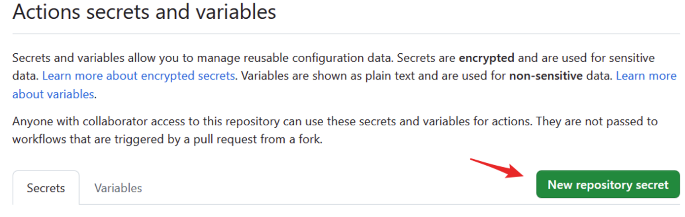

# Cloudreve Anime Automatic Subscription
Subscribe RSS of Anime Torrent sites and call cloudreve offline downloading to get you latest animes.

## Usage
### User config
| Variable                  | Description                                         | Example Value          |
|---------------------------|-----------------------------------------------------|------------------------|
| `Cloudreve_email`               | Email associated with Cloudreve website.                | `user@example.com`     |
| `Cloudreve_password`            | Password for the Cloudreve.                        | `passwordiiyokoiyo`          |
| `Cloudreve_url`     | Cloudreve_url.                   | yourcloudreve.com      |
| `download_dir`     | Cloudreve download base dir. (The first `/` means that the path is relative to cloudreve root thus it's necessary.)                   |   /anime_download/cloudreve_anisub    |
| `acgrip_url(example)`                 | URL of the RSS feed.                               | `https://acg.rip`|
| `acgrip_enable(example)` | Whether to enable this rss source  | `1`  (currently not used)                    |
| `enable_email_notify`      | Whether to notify downloading result via email  (1 enable, 0 disable)  | `1` |
| `Email_sender`            | Email address used to send emails.                 | `sender@example.com`   |
| `Email_receivers`         | Email addresses designated to receive emails.      | `receiver@example.com` |
| `Email_smtp_host`         | SMTP server address used to send emails.           | `smtp.example.com`     |
| `Email_smtp_port`         | SMTP server port used to send emails.              | `11451`                  |
| `Email_mail_license`      | SMTP password or authorization used for sending emails.  | `1145141919810`  |
<br>
### Use Github Action
1. Fork the repo
2. Use your own information to set the needed secrets in your repo(Repo Settings -- Secrets and variables -- Actions -- Secrets). You need an email with SMTP host, port, account and app password. Check out [User config](#(User%20config)) for the full config we need.

3. Write your subscriptions into `subscriptions`. One sub occupies one line. In single line, the first two element represents rss source (acgrip, mikann, dmhy or ...) and `folder name` of the anime to be saved in your cloudreve. Note that this dir is relative to the `download_dir` in the user config. The remaining things are your keywords to match in the RSS title. The keyword number is not limited. Lastly, every element should be separated by `|` with no space (But space is allowed inside keyword).
4. Enable Workflow r/w permissions
Settings -- Actions -- General


Then the action will be triggered when pushing to repo or reaching a certain time everyday. The latter can be set in the auto_download.yml. 

### Use Docker
1. Download the config file:
```
wget https://github.com/Freddd13/cloudreve-anisub/blob/main/localconfig.yaml?raw=true -O .localconfig.yaml
```
2. Replace your own data in the yaml above. Check out [User config](#(User%20config)) for the full config we need. (The varaible name is for env, but it should be easily understood for yaml.)
3. Enable Workflow r/w permissions
3. Download image and run:
```
docker pull fredyu13/cloudreve-anisub
docker run -d --name cloudreve-anisub -v $(pwd)/.localconfig.yaml:/app/.localconfig.yaml fredyu13/cloudreve-anisub
```

## Develop
### Run locally
1. Clone this repo
2. Create a .localconfig.yaml from localconfig.yaml and fill in your data. Check out [User config](#(User%20config)) for the full config we need. (The varaible name is for env, but it should be easily understood for yaml.)
3. Enable Workflow r/w permissions
3. `pip install -r requirements.txt`
4. Set env `CLOUDREVE_ANISUB_ENV` to `LOCAL`
4. `python main.py`

### Build Docker
1. Clone this repo
2. Create a .localconfig.yaml from localconfig.yaml and fill in your data. 
3. `docker build -t cloudreve-anisub -f docker/Dockerfile .`
4. `docker run -d --name cloudreve-anisub cloudreve-anisub:latest`
The schedule task can be adjusted by modifing the ./docker/crontab.

## Note
### About RSS
- current only part of websites are supported, but you can implement yours by completing method according to the base_rss.py. Remember the source name in the `subscription` should be consistent with the `_name` in your class.


### About Email
The `enable_email_notify` is used to send you downloading result including sheets and app log. If you disable the email, there's still another way to save your sheets: remove the `MMS_savefolder_path` directory if it exists in the `.gitignore`. The action will update the downloaded sheets to your repo. But it's not a good behavior to share others' sheets without permission, thus it's not recommended to disable email before other uploading method is supported.


## TODO
- [x] Email notification
- [ ] Bot notification
- [ ] Docker support
- [ ] More websites support
    - [x] acgrip
    - [ ] dmhy
    - [ ] bgmoe
    - [ ] mikan
    - [ ] nyaa


# Disclaimer:
The scripts provided in this repo is intended for personal use and convenience. It is the user's responsibility to use this tool in accordance with the terms of service and policies of anime.

The author of this repo shall not be held responsible for any misuse or improper use of this tool, including but not limited to any violations of MMS's terms of service, copyright infringement, or any other legal or ethical concerns.

Users are advised to exercise discretion and adhere to all applicable laws and regulations when using this tool. The author of this tool disclaim all liability for any consequences resulting from the use of this tool.

By using this tool, you agree to accept all responsibility and legal consequences that may arise from its use.
Please use this tool responsibly and in compliance with terms and conditions in your country.
